 

&nbsp;
&nbsp;

---

<!-- SHIPPING:START -->
<table>
  <tr>
    <td width="50%" valign="top">
      <h4>🛠️ <a href="https://github.com/aks-builds/cliproof">cliproof</a></h4>
      Prove your CLI actually works. Captures real terminal output as polished screenshots/GIFs — secrets redacted, CI-guarded, embedded into README as proof-it-runs evidence.
    </td>
    <td width="50%" valign="top">
      <h4>🤖 <a href="https://github.com/aks-builds/ai-test-failure-analyzer">ai-test-failure-analyzer</a></h4>
      Traces Playwright, Jest, Cypress, Newman, k6 and JUnit failures through git, logs, and config — no guesses, no fixture noise.
    </td>
  </tr>
  <tr>
    <td width="50%" valign="top">
      <h4>📋 <a href="https://github.com/aks-builds/openspecpm">openspecpm</a></h4>
      Spec-driven, BDD-shaped project management for AI agents. OpenSpec proposals → BDD specs → tracked work in GitHub / Jira / Linear / GitLab.
    </td>
    <td width="50%" valign="top">
      <h4>🔫 <a href="https://github.com/aks-builds/Hitro">Hitro</a></h4>
      Local-first desktop API client — REST, gRPC, GraphQL, WebSocket, Kafka, AWS SQS, MQTT, SSE — with built-in mock server, load testing, and snapshot testing.
    </td>
  </tr>
  <tr>
    <td width="50%" valign="top">
      <h4>🧪 <a href="https://github.com/aks-builds/reqweave">reqweave</a></h4>
      Read your service code; generate ready-to-import API collections for Postman, OpenAPI, Insomnia, Bruno, Hoppscotch, and more.
    </td>
    <td width="50%" valign="top">
      <h4>🏆 <a href="https://github.com/aks-builds/quality-skills">quality-skills</a></h4>
      50 production-focused Quality Engineering Claude Code skills for QA Engineers, SDETs, and Automation Architects.
    </td>
  </tr>
</table>
<!-- SHIPPING:END -->

---

  

<table>
  <tr>
    <td align="center">
      
    </td>
    <td align="center">
      
    </td>
    <td align="center">
      
    </td>
  </tr>
</table>

---

  

<!-- LANGS:START -->

<!-- LANGS:END -->

---

  

<table>
  <tr>
    <td align="center" width="33%">
      
       
      <b>Smart Test Data — Faker vs AI</b> 
      NashKnolX
    </td>
    <td align="center" width="33%">
      
       
      <b>Testing Event-Driven Architecture</b> 
      NashKnolX
    </td>
    <td align="center" width="33%">
      
       
      <b>Clean Code in Test Automation</b> 
      NashKnolX
    </td>
  </tr>
</table>

  

---

  

 

---

<b>&gt;_ Recent Activity</b>

 

<!--START_SECTION:activity-->
1. ⬆️ Pushed to [aks-builds/aks-builds.github.io](https://github.com/aks-builds/aks-builds.github.io)
2. ⬆️ Pushed to [aks-builds/cliproof](https://github.com/aks-builds/cliproof)
3. ⬆️ Pushed to [aks-builds/ai-test-failure-analyzer](https://github.com/aks-builds/ai-test-failure-analyzer)
4. 💪 Opened PR in [aks-builds/reqweave](https://github.com/aks-builds/reqweave)
5. ⬆️ Pushed to [aks-builds/reqweave](https://github.com/aks-builds/reqweave)
<!--END_SECTION:activity-->

---

  <code>// I break things for a living, build AI to explain why — and race F1 on weekends (simulated, sadly).</code>

